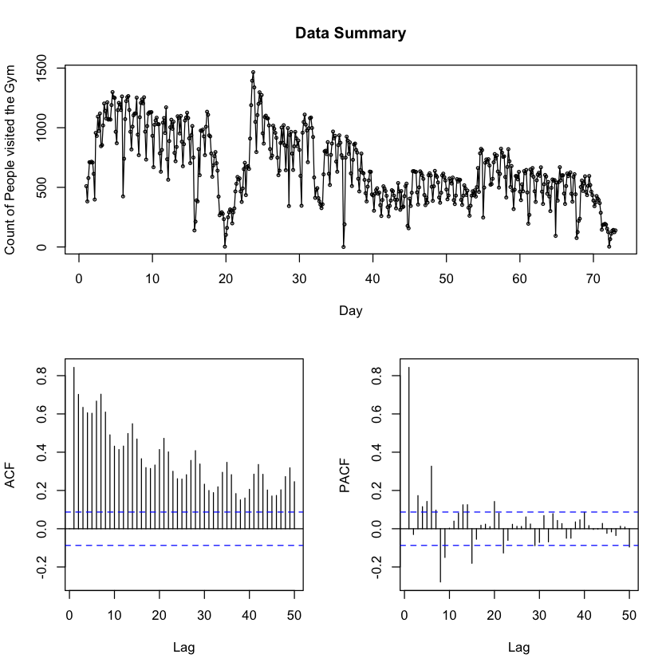

# Predicting the Daily Occupancy in the University Gym

###### Importing required packages


```R
library(forecast)
library(ggplot2)
library(tseries)
library(lmtest)
```

###### Importing & Cleaning the dataset


```R
data = read.csv('Daily_data')
head(data)
print(nrow(data))
```


<table>
<thead><tr><th scope=col>number_people</th></tr></thead>
<tbody>
	<tr><td>510</td></tr>
	<tr><td>382</td></tr>
	<tr><td>578</td></tr>
	<tr><td>711</td></tr>
	<tr><td>709</td></tr>
	<tr><td>715</td></tr>
</tbody>
</table>


    [1] 505


```R
data.ts = ts(data,frequency = 7)
tsdisplay(data.ts,ylab = "Count of People visited the Gym",xlab="Day",main = "Data Summary",lag.max = 50)
```





#### Observations from the Data:-
1. The series doesn't look stationary, seems to have some downward trend and seasonality
2. Peaks in PACF can be clearly seen at Lag 1 and "around" Lag 7, which indicates a seasonality of period 7, which also makes sense as it is a Daily Data.
3. Let us follow the following steps to further analyze the series

###### Let us decompose the series to further see any trend or seasonality clearly


```R
plot(decompose(data.ts))
```


###### Let us check the stationarity of the series using a more formal test "Augmented Dickey-Fuller Test"


```R
adf.test(data.ts,alternative = "stationary",k = 20)
```


    
    	Augmented Dickey-Fuller Test
    
    data:  data.ts
    Dickey-Fuller = -2.9577, Lag order = 20, p-value = 0.1729
    alternative hypothesis: stationary


#### Observations:-
1. Above the pvalue is greater than 0.05, therefore we will not reject the Null Hypothesis of "Non Stationarity"
2. Let us do some ARMA fitting

###### First let us try to fit an ARMA model without any trend or seasonality, we will choose the best model based on AIC value


```R
model = auto.arima(data.ts,max.p = 10,max.q = 10,max.d = 0,seasonal = FALSE)
print(summary(model))
plot(model) 
```

    Series: data.ts 
    ARIMA(1,0,3) with non-zero mean 
    
    Coefficients:
             ar1      ma1      ma2      ma3  intercept
          0.9766  -0.1636  -0.3130  -0.1520   626.5109
    s.e.  0.0121   0.0471   0.0418   0.0456    99.7747
    
    sigma^2 estimated as 22650:  log likelihood=-3246.94
    AIC=6505.88   AICc=6506.04   BIC=6531.22
    
    Training set error measures:
                        ME     RMSE      MAE  MPE MAPE      MASE         ACF1
    Training set 0.1453513 149.7512 109.5344 -Inf  Inf 0.7691175 -0.005301773
                        ME     RMSE      MAE  MPE MAPE      MASE         ACF1
    Training set 0.1453513 149.7512 109.5344 -Inf  Inf 0.7691175 -0.005301773


#### Observations from above model
1. We get an ARIMA(1,0,3) 
2. We have 1 real AR root with absolute value=1, which indicates a linear trend.
3. Let us allow the model to include that trend


```R
model2 = auto.arima(data.ts,max.p = 10,max.q = 10,seasonal = FALSE)
print(summary(model2))
plot(model2)
```

    Series: data.ts 
    ARIMA(2,1,2)                    
    
    Coefficients:
             ar1      ar2      ma1     ma2
          1.2282  -0.9496  -1.3040  0.8882
    s.e.  0.0180   0.0225   0.0249  0.0283
    
    sigma^2 estimated as 21126:  log likelihood=-3223.45
    AIC=6456.9   AICc=6457.02   BIC=6478.01
    
    Training set error measures:
                         ME     RMSE     MAE  MPE MAPE      MASE       ACF1
    Training set -0.8809571 144.6272 101.827 -Inf  Inf 0.7149984 -0.1751595
                         ME     RMSE     MAE  MPE MAPE      MASE       ACF1
    Training set -0.8809571 144.6272 101.827 -Inf  Inf 0.7149984 -0.1751595


#### Observations from above model
1. We get an ARMA(2,1,2)
2. We have a conjugate pair with absolute value=1, which indicates a seasonality
3. Let us allow the model to include that seasonality


```R
model3 = auto.arima(data.ts,max.p = 10,max.q = 10)
print(summary(model3))
plot(model3)
```

    Series: data.ts 
    ARIMA(4,1,5)(2,0,0)[7]                    
    
    Coefficients:


    Warning message in sqrt(diag(x$var.coef)):
    “NaNs produced”

            ar1     ar2     ar3      ar4      ma1      ma2     ma3     ma4      ma5
          0.202  1.2622  0.0535  -0.6104  -0.4832  -1.4302  0.3249  0.8854  -0.2937
    s.e.    NaN  0.0843     NaN   0.0689      NaN   0.0534     NaN  0.0754   0.0581
            sar1    sar2
          0.4203  0.3204
    s.e.  0.0487  0.0470
    
    sigma^2 estimated as 16938:  log likelihood=-3165.27
    AIC=6354.55   AICc=6355.18   BIC=6405.22
    
    Training set error measures:
                        ME     RMSE      MAE  MPE MAPE      MASE         ACF1
    Training set -5.364576 128.5909 87.70069 -Inf  Inf 0.6158079 -0.007524267
                        ME     RMSE      MAE  MPE MAPE      MASE         ACF1
    Training set -5.364576 128.5909 87.70069 -Inf  Inf 0.6158079 -0.007524267


#### Observations from above model
1. We get an ARMA(2,1,1)(2,0,0)[7]
2. Let us analyze the residuals for whiteness


```R
tsdisplay(model3$residuals,lag.max = 50)
```


###### We have some significant peaks here, let us try to model the seasonality using deterministic fourier terms


```R
aic_vals_temp = NULL
aic_vals = NULL
for (i in (1:3))
        {
            xreg1 = fourier(x=data.ts,i)
            #xreg2 = fourier(x=data.msts,j,24*7)
            #xtrain = cbind(xreg1,xreg2)
            fitma1 = auto.arima(data.ts,xreg = xreg1)
            aic_vals_temp = cbind(i,fitma1$aic)
            aic_vals = rbind(aic_vals,aic_vals_temp)
        } 
colnames(aic_vals) = c("FourierTerms7","AICValue")
aic_vals = data.frame(aic_vals)
minAICVal = min(aic_vals$AICValue)
minvals = aic_vals[which(aic_vals$AICValue==minAICVal),]
print(minvals)
head(xreg1)
```

      FourierTerms7 AICValue
    3             3 6279.068


<table>
<thead><tr><th scope=col>S1-7</th><th scope=col>C1-7</th><th scope=col>S2-7</th><th scope=col>C2-7</th><th scope=col>S3-7</th><th scope=col>C3-7</th></tr></thead>
<tbody>
	<tr><td> 0.7818315</td><td> 0.6234898</td><td> 0.9749279</td><td>-0.2225209</td><td> 0.4338837</td><td>-0.9009689</td></tr>
	<tr><td> 0.9749279</td><td>-0.2225209</td><td>-0.4338837</td><td>-0.9009689</td><td>-0.7818315</td><td> 0.6234898</td></tr>
	<tr><td> 0.4338837</td><td>-0.9009689</td><td>-0.7818315</td><td> 0.6234898</td><td> 0.9749279</td><td>-0.2225209</td></tr>
	<tr><td>-0.4338837</td><td>-0.9009689</td><td> 0.7818315</td><td> 0.6234898</td><td>-0.9749279</td><td>-0.2225209</td></tr>
	<tr><td>-0.9749279</td><td>-0.2225209</td><td> 0.4338837</td><td>-0.9009689</td><td> 0.7818315</td><td> 0.6234898</td></tr>
	<tr><td>-0.7818315</td><td> 0.6234898</td><td>-0.9749279</td><td>-0.2225209</td><td>-0.4338837</td><td>-0.9009689</td></tr>
</tbody>
</table>


```R
xreg1 = fourier(x=data.ts,3)
model4 = auto.arima(data.ts,xreg = xreg1)
print(summary(model4))
tsdisplay(model4$residuals,lag.max = 50)
```

    Series: data.ts 
    ARIMA(2,1,2)                    
    
    Coefficients:
             ar1      ar2      ma1     ma2       S1-7     C1-7     S2-7     C2-7
          1.2292  -0.2769  -1.5399  0.5464  -124.4644  -4.4885  18.1375  55.2599
    s.e.  0.1494   0.1305   0.1348  0.1322     8.2703   8.2734   5.6014   5.6053
             S3-7    C3-7
          14.6683  7.7894
    s.e.   4.7488  4.7472
    
    sigma^2 estimated as 14699:  log likelihood=-3128.53
    AIC=6279.07   AICc=6279.6   BIC=6325.52
    
    Training set error measures:
                        ME     RMSE      MAE  MPE MAPE      MASE        ACF1
    Training set -5.416399 119.9101 78.54306 -Inf  Inf 0.5515057 0.001849326
                        ME     RMSE      MAE  MPE MAPE      MASE        ACF1
    Training set -5.416399 119.9101 78.54306 -Inf  Inf 0.5515057 0.001849326


#### Observations from the Final Model
1. We have ARIMA(2,1,2) model with fourier terms for seasonality = 7 used as extra regressors
2. In residuals there is no significant correlation of the lags except at Lag=30, which might indicate a monthly seasonality.
3. In our analysis we opt not to include another seasonality to keep the model simple.
3. We will further analyze the residuals for whiteness


```R
hist(model4$residuals, breaks="FD", xlab="Residuals", 
 main="Histogram of residuals")
```


#### Observations:-
1. Residuals are Not correlated and are approximately normal.
2. We will use this model for fitting and making Predictions

#### Forecasting:-
1. We will divide the dataset into training and test set to make the predictions


```R
fit_no_holdout = Arima(ts(data.ts[c(1:495),]), order=c(2,1,2),xreg = xreg1[c(1:495),])

fcast_no_holdout = forecast(fit_no_holdout,h=10,xreg =xreg1[c(496:505),])

plot(fcast_no_holdout,main = "Forecast for next 10 values")
lines(ts(data.ts))
```


#### Improvements and Future Scope:
1. Add monthly seasonality in the model.
2. Consider other factors like climate and model it as multivariate time series.
3. We can also add university holidays as a binary variable and use it as extra regressor
